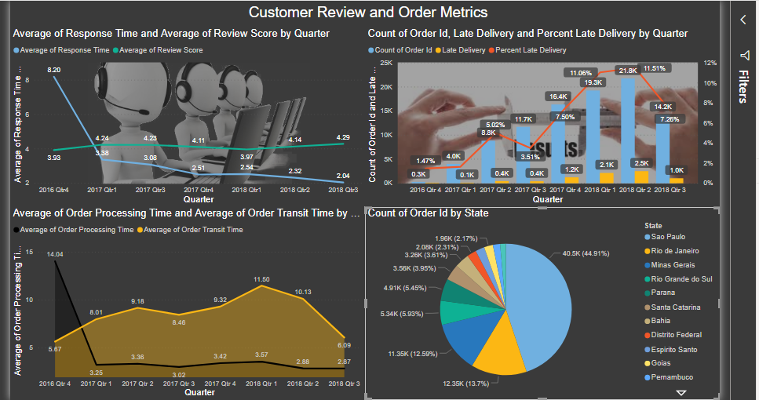

# Power-Bi-Market-Analysis
Using Power BI as a canvas which will represent the various trends of company through visualization of the data. Undoubtedly dashboard contains the most important elements among all the productive pillars of the company. Through power BI, proposing a dashboard which will be used as platform for the purpose of visualization.
The Visualization through dashboard will empower business owners on 
1. Trends of orders 
2. Revenue
3. Customer relationship metrics among other KPIs. 

#### Dashboards
[https://github.com/nandita96/Power-Bi-Market-Analysis/blob/master/Order_and_customer_Review_metrics.mp4)

## 1. Order_and_customer_Review_metrics

